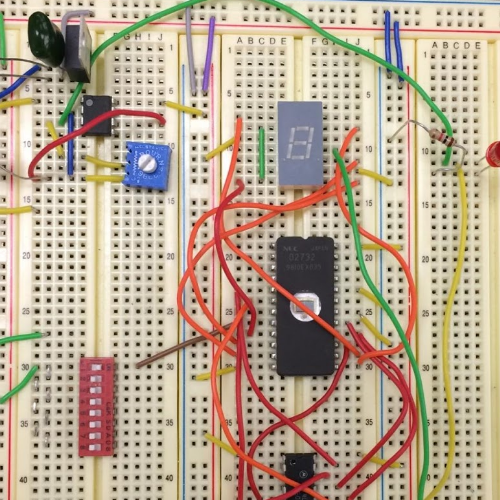
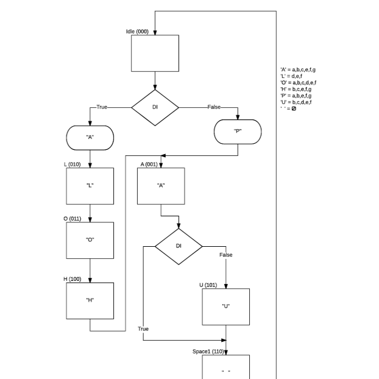

  
  
  

Aloha Pau was a project undergone by myself and my three other lab partners for an EE 260 Lab. We created a circuit that would either cycle through the word “ALOHA” or “PAU” based on if a switch was on or off. The letters would appear on a single 7 segment display.

We initially designed a state machine diagram to represent the logical movement between states. From this diagram we then created an encoded state table. This table gave us an organized version of what is outputted between each state as well as what happens after each state. These two diagrams helped us create the circuit diagram in Logicworks. In this program we are able to design and simulate the program. After bug testing in Logicworks, we create the physical circuit on a breadboard that performed with no problems.

For the most part we worked together as a team on all parts of the project. My role was primarily in the Logicworks design and then the implementation on the breadboard.

