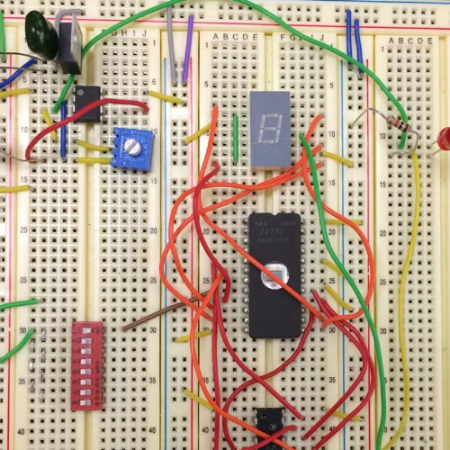
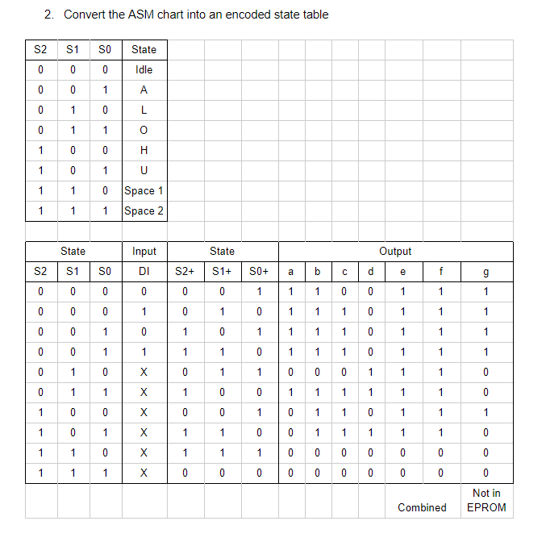
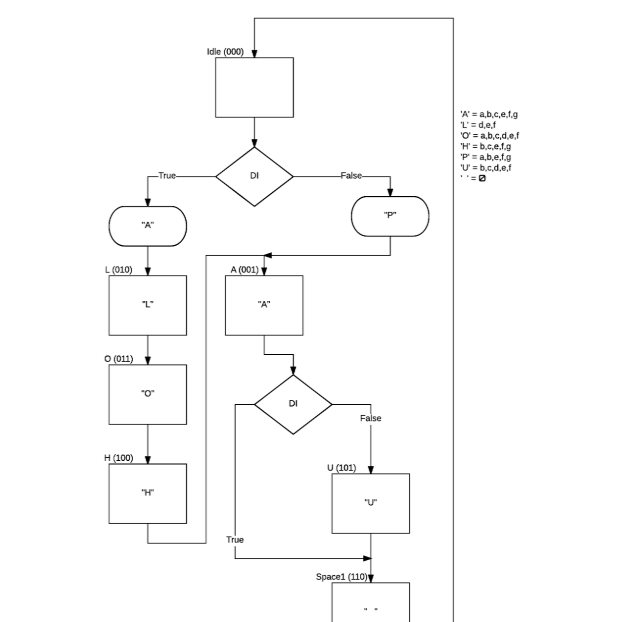

<div class="ui small rounded images">
  
  
  
</div>

Aloha Pau was a project undergone by myself and my three other lab partners for an EE 260 Lab. We created a circuit that would either cycle through the word “ALOHA” or “PAU” based on if a switch was on or off. The letters would appear on a single 7 segment display.

We initially designed a state machine diagram to represent the logical movement between states. From this diagram we then created an encoded state table. This table gave us an organized version of what is outputted between each state as well as what happens after each state. These two diagrams helped us create the circuit diagram in Logicworks. In this program we are able to design and simulate the program. After bug testing in Logicworks, we create the physical circuit on a breadboard that performed with no problems.


Here is some code that illustrates how we read values from the line sensors:

```js
byte ADCRead(byte ch)
{
    word value;
    ADC1SC1 = ch;
    while (ADC1SC1_COCO != 1)
    {   // wait until ADC conversion is completed   
    }
    return ADC1RL;  // lower 8-bit value out of 10-bit data from the ADC
}
```

You can learn more at the [UH Micromouse Website](http://www-ee.eng.hawaii.edu/~mmouse/about.html).


